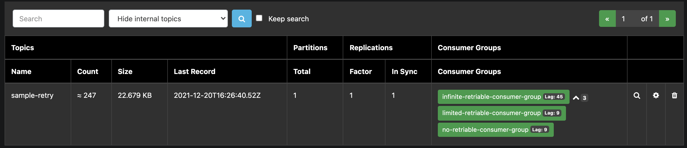

# Retriable consumer kafka dotnet

Inspired from https://github.com/jeanlouisboudart/retriable-consumer for .NET Clients

## Build local images

This repository contains some local docker images including:

* a simple producer 
* a retriable consumer

To build all images run:

``` bash
docker-compose build
```

## Start environment

To start the environment simply run the following command

```
docker-compose up -d
```

This starts:

- Zookeeper
- Kafka
- a simple producer, which produces one message per second
- a consumer with no retry mechanism (0 retries, if the external service call fails the message is skipped)
- a consumer with limited number of retries (max retry: 10)
- a consumer with infinite number of retries (uses pause/resume from Kafka's Consumer API. It retries the message delivery until the web service call is successful)
- a consumer with a limited number of retries (max retry: 20) which violates the consumer's requirement to regularly call poll. The retry-behavior triggers the `max.poll.interval.ms`-timeout


Please see
* http://localhost:8082/ for consumer lag information
* the application logs via `docker-compose logs -f <container>` for detailed client behavior.

Key examples are provided below.





## no-retry-consumer

``` bash
docker-compose logs -f no-retry-consumer
```

This consumer ignores failures in case of errors when calling an external system.

## limited-retries-consumer

``` bash
docker-compose logs -f limited-retries-consumer
```

This consumer retries X times in case of errors when calling an external system.

Increase the number of max retries via env var `KAFKA_NUMBER_RETRY` in `docker-compose.yml`.


## infinite-retries-consumer

``` bash
docker-compose logs -f infinite-retries-consumer
```

This consumer retries infinitely in case of errors when calling an external system. 

In case of failures when calling the external service, the consumer is paused and the offset is set to the previously successfully processed record. The next call to `poll(timeout)` honours the timeout and returns an empty record. Honouring the timeout while paused acts as backoff between retry attempts.

## max-poll-internal-raising-consumer

``` bash
docker-compose logs -f max-poll-internal-raising-consumer
```

This consumer forces a violation of the `max.poll.interval.ms` timeout by naively retrying inside of the `poll`-loop.


Configuration
``` yaml
KAFKA_NUMBER_RETRY: 20 # 0 = NO_RETRY, -1 = INFINITE_RETRY, > 0 = MAX_RETRY
KAFKA_GROUP_ID: "max-poll-internal-raising-consumer-group"
KAFKA_RESET_STRATEGY: "earliest"
KAFKA_MAX_POLL_INTERVAL_MS: 60000 # 1 min
KAFKA_SIMULATE_EXTERNAL: "true" # Simulate external call see retriable_consumer. ExternalService class
KAFKA_EXTERNAL_PERCENTAGE_FAILURES: 100 # 100 percent failure
DURATION_SLEEP_SERVICE_FAIL: 4000 # 4 seconds
KAFKA_COMMIT_INTERVAL_MS: 10000 # 10 seconds
```

The consumer calls an external service inside of the `poll`-loop. On failure, the app retries 20 times. The  external system returns errors in 100% of the calls. Each call takes 4 seconds to respond. 
Processing individual records, hence, takes 
`20 * 4 s = 80 s`.

`max.poll.interval.ms` is set to `60000 ms (1 minute) < 80 seconds` for processing records.

**What happens?**

During the processing (retrying to deliver to the external system), a consumer background thread throws a `max.poll.internal.ms`-error internally, and the consumer leaves the consumer group.

When the consumer attempts to commit the offsets after the 20 retries an exception is thrown. The consumer has left the group and is not a known group member. 

The program catches the expection, logs it and, creates a new consumer instance from scratch.

The new consumer instance reprocesses the previous record(s) - there was no successful commit - retries to call the external service 20 times, etc.  

Since the consumer looses its in-memory offset dictionary when leaving the group, the consumer has to re-process the same record indefinitely.  

When naively retrying inside of the `poll`- loop be aware of the following:
* unitary time to call the external system
* number of retries
* `max.poll.internal.ms` consumer configuration

The expected retry period must be smaller than the `max.poll.interval.ms`-timeout. 
I.e. `number-of-retries * max(unitary-call-time) < max-poll-internal-ms`. Otherwise, the consumer instance is evicted from the consumer group.
